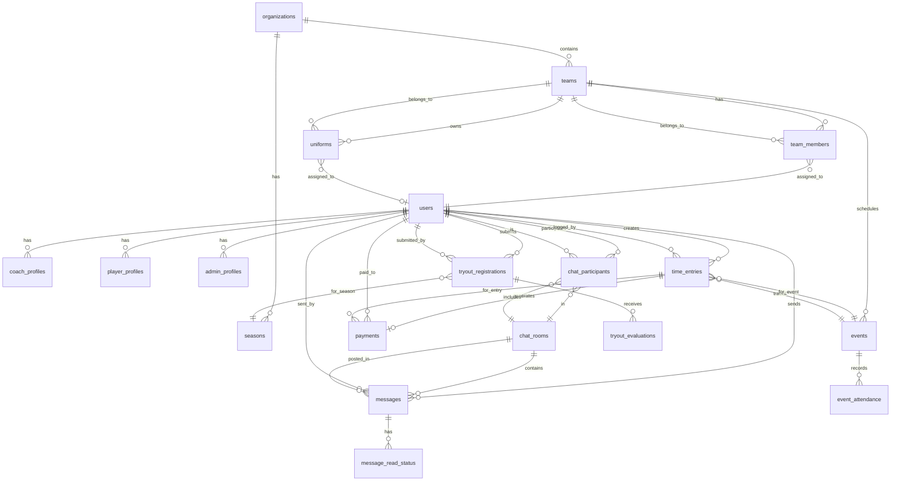

# Database Schema Documentation

## System Overview

This database schema supports a comprehensive sports coaching management platform with the following core modules:

- **User Management**: Authentication, profiles, and role-based access control
- **Team & Roster Management**: Organization hierarchy, teams, and player assignments
- **Timesheet & Compensation**: Time tracking, event logging, and payment processing
- **Event Scheduling**: Games, practices, and calendar management
- **Messaging System**: Real-time chat with rooms and participants
- **Tryout Operations**: Registration, evaluation, and selection workflow
- **Uniform Inventory**: Equipment tracking and assignment
- **Document Management**: File uploads and sharing

---

## Entity Relationship Diagram



---

## Table Definitions

### 1. User Management

#### `users` (Supabase Auth Table)
Managed by Supabase Auth. Contains core authentication data.

| Column Name | Data Type | Constraints | Description |
|------------|-----------|-------------|-------------|
| id | uuid | PRIMARY KEY | Unique user identifier (managed by Supabase Auth) |
| email | text | UNIQUE, NOT NULL | User's email address |
| created_at | timestamptz | NOT NULL, DEFAULT now() | Account creation timestamp |
| updated_at | timestamptz | NOT NULL, DEFAULT now() | Last update timestamp |
| raw_user_meta_data | jsonb | | User-editable metadata |
| raw_app_meta_data | jsonb | | System metadata (roles, permissions) |

#### `user_profiles`
Extended profile information for all users.

| Column Name | Data Type | Constraints | Description |
|------------|-----------|-------------|-------------|
| id | uuid | PRIMARY KEY | References auth.users(id) ON DELETE CASCADE |
| first_name | text | NOT NULL | User's first name |
| last_name | text | NOT NULL | User's last name |
| phone | text | | Contact phone number |
| date_of_birth | date | | User's date of birth |
| avatar_url | text | | Profile picture URL |
| address_line1 | text | | Street address |
| address_line2 | text | | Apartment/Suite number |
| city | text | | City |
| state | text | | State/Province |
| postal_code | text | | ZIP/Postal code |
| country | text | DEFAULT 'US' | Country code |
| emergency_contact_name | text | | Emergency contact full name |
| emergency_contact_phone | text | | Emergency contact phone |
| status | text | NOT NULL, DEFAULT 'active' | active, inactive, suspended |
| created_at | timestamptz | NOT NULL, DEFAULT now() | Profile creation timestamp |
| updated_at | timestamptz | NOT NULL, DEFAULT now() | Last update timestamp |

**Indexes:**
- `idx_user_profiles_status` on (status)
- `idx_user_profiles_last_name` on (last_name)

#### `coach_profiles`
Additional information specific to coaches.

| Column Name | Data Type | Constraints | Description |
|------------|-----------|-------------|-------------|
| id | uuid | PRIMARY KEY, DEFAULT gen_random_uuid() | Unique coach profile ID |
| user_id | uuid | NOT NULL, UNIQUE, FOREIGN KEY | References user_profiles(id) ON DELETE CASCADE |
| coaching_license | text | | License/certification number |
| specialization | text[] | | Array of coaching specializations |
| years_experience | integer | | Years of coaching experience |
| hourly_rate | decimal(10,2) | | Hourly compensation rate |
| per_event_rate | decimal(10,2) | | Per-event compensation rate |
| payment_type | text | NOT NULL, DEFAULT 'hourly' | hourly, per_event, salary |
| bio | text | | Coach biography |
| background_check_status | text | DEFAULT 'pending' | pending, approved, rejected, expired |
| background_check_date | date | | Date of last background check |
| created_at | timestamptz | NOT NULL, DEFAULT now() | Record creation timestamp |
| updated_at | timestamptz | NOT NULL, DEFAULT now() | Last update timestamp |

**Indexes:**
- `idx_coach_profiles_user_id` on (user_id)
- `idx_coach_profiles_payment_type` on (payment_type)

#### `player_profiles`
Additional information specific to players.

| Column Name | Data Type | Constraints | Description |
|------------|-----------|-------------|-------------|
| id | uuid | PRIMARY KEY, DEFAULT gen_random_uuid() | Unique player profile ID |
| user_id | uuid | NOT NULL, UNIQUE, FOREIGN KEY | References user_profiles(id) ON DELETE CASCADE |
| jersey_number | text | | Player's jersey number |
| position | text | | Playing position |
| height | integer | | Height in centimeters |
| weight | integer | | Weight in kilograms |
| dominant_hand | text | | left, right, ambidextrous |
| parent_guardian_name | text | | Parent/Guardian name (for minors) |
| parent_guardian_phone | text | | Parent/Guardian phone |
| parent_guardian_email | text | | Parent/Guardian email |
| medical_conditions | text | | Known medical conditions |
| allergies | text | | Known allergies |
| insurance_provider | text | | Health insurance provider |
| insurance_policy_number | text | | Insurance policy number |
| created_at | timestamptz | NOT NULL, DEFAULT now() | Record creation timestamp |
| updated_at | timestamptz | NOT NULL, DEFAULT now() | Last update timestamp |

**Indexes:**
- `idx_player_profiles_user_id` on (user_id)

#### `admin_profiles`
Additional information for system administrators.

| Column Name | Data Type | Constraints | Description |
|------------|-----------|-------------|-------------|
| id | uuid | PRIMARY KEY, DEFAULT gen_random_uuid() | Unique admin profile ID |
| user_id | uuid | NOT NULL, UNIQUE, FOREIGN KEY | References user_profiles(id) ON DELETE CASCADE |
| role | text | NOT NULL, DEFAULT 'admin' | super_admin, admin, manager |
| permissions | jsonb | NOT NULL, DEFAULT '{}' | JSON object of permissions |
| created_at | timestamptz | NOT NULL, DEFAULT now() | Record creation timestamp |
| updated_at | timestamptz | NOT NULL, DEFAULT now() | Last update timestamp |

---

### 2. Organization & Team Structure

#### `organizations`
Top-level organizational entities.

| Column Name | Data Type | Constraints | Description |
|------------|-----------|-------------|-------------|
| id | uuid | PRIMARY KEY, DEFAULT gen_random_uuid() | Unique organization ID |
| name | text | NOT NULL | Organization name |
| slug | text | UNIQUE, NOT NULL | URL-friendly identifier |
| logo_url | text | | Organization logo |
| website | text | | Organization website |
| contact_email | text | | Primary contact email |
| contact_phone | text | | Primary contact phone |
| address_line1 | text | | Street address |
| address_line2 | text | | Apartment/Suite |
| city | text | | City |
| state | text | | State/Province |
| postal_code | text | | ZIP/Postal code |
| country | text | DEFAULT 'US' | Country code |
| timezone | text | DEFAULT 'America/New_York' | Organization timezone |
| status | text | NOT NULL, DEFAULT 'active' | active, inactive, suspended |
| created_at | timestamptz | NOT NULL, DEFAULT now() | Creation timestamp |
| updated_at | timestamptz | NOT NULL, DEFAULT now() | Last update timestamp |

**Indexes:**
- `idx_organizations_slug` on (slug)
- `idx_organizations_status` on (status)

#### `seasons`
Seasonal periods for team activities.

| Column Name | Data Type | Constraints | Description |
|------------|-----------|-------------|-------------|
| id | uuid | PRIMARY KEY, DEFAULT gen_random_uuid() | Unique season ID |
| organization_id | uuid | NOT NULL, FOREIGN KEY | References organizations(id) ON DELETE CASCADE |
| name | text | NOT NULL | Season name (e.g., "Spring 2025") |
| start_date | date | NOT NULL | Season start date |
| end_date | date | NOT NULL | Season end date |
| registration_start | date | | Registration opening date |
| registration_end | date | | Registration closing date |
| status | text | NOT NULL, DEFAULT 'upcoming' | upcoming, active, completed |
| created_at | timestamptz | NOT NULL, DEFAULT now() | Creation timestamp |
| updated_at | timestamptz | NOT NULL, DEFAULT now() | Last update timestamp |

**Indexes:**
- `idx_seasons_org_id` on (organization_id)
- `idx_seasons_status` on (status)
- `idx_seasons_dates` on (start_date, end_date)

**Constraints:**
- CHECK (end_date > start_date)

#### `teams`
Individual teams within an organization.

| Column Name | Data Type | Constraints | Description |
|------------|-----------|-------------|-------------|
| id | uuid | PRIMARY KEY, DEFAULT gen_random_uuid() | Unique team ID |
| organization_id | uuid | NOT NULL, FOREIGN KEY | References organizations(id) ON DELETE CASCADE |
| season_id | uuid | FOREIGN KEY | References seasons(id) ON DELETE SET NULL |
| name | text | NOT NULL | Team name |
| age_group | text | | Age group (e.g., "U12", "U15") |
| skill_level | text | | competitive, recreational, elite |
| max_roster_size | integer | DEFAULT 20 | Maximum number of players |
| practice_schedule | jsonb | | JSON object with practice days/times |
| home_venue | text | | Home venue location |
| team_color_primary | text | | Primary team color (hex code) |
| team_color_secondary | text | | Secondary team color (hex code) |
| status | text | NOT NULL, DEFAULT 'active' | active, inactive, archived |
| created_at | timestamptz | NOT NULL, DEFAULT now() | Creation timestamp |
| updated_at | timestamptz | NOT NULL, DEFAULT now() | Last update timestamp |

**Indexes:**
- `idx_teams_org_id` on (organization_id)
- `idx_teams_season_id` on (season_id)
- `idx_teams_status` on (status)

#### `team_members`
Junction table linking users to teams with roles.

| Column Name | Data Type | Constraints | Description |
|------------|-----------|-------------|-------------|
| id | uuid | PRIMARY KEY, DEFAULT gen_random_uuid() | Unique membership ID |
| team_id | uuid | NOT NULL, FOREIGN KEY | References teams(id) ON DELETE CASCADE |
| user_id | uuid | NOT NULL, FOREIGN KEY | References user_profiles(id) ON DELETE CASCADE |
| role | text | NOT NULL | head_coach, assistant_coach, player, manager |
| jersey_number | text | | Player's jersey number on this team |
| joined_date | date | NOT NULL, DEFAULT CURRENT_DATE | Date joined team |
| left_date | date | | Date left team (if applicable) |
| status | text | NOT NULL, DEFAULT 'active' | active, inactive, suspended |
| created_at | timestamptz | NOT NULL, DEFAULT now() | Creation timestamp |
| updated_at | timestamptz | NOT NULL, DEFAULT now() | Last update timestamp |

**Indexes:**
- `idx_team_members_team_id` on (team_id)
- `idx_team_members_user_id` on (user_id)
- `idx_team_members_role` on (role)
- `idx_team_members_status` on (status)

**Constraints:**
- UNIQUE (team_id, user_id, status) WHERE status = 'active'
- CHECK (left_date IS NULL OR left_date >= joined_date)

---

### 3. Events & Scheduling

#### `events`
Games, practices, and other team events.

| Column Name | Data Type | Constraints | Description |
|------------|-----------|-------------|-------------|
| id | uuid | PRIMARY KEY, DEFAULT gen_random_uuid() | Unique event ID |
| team_id | uuid | NOT NULL, FOREIGN KEY | References teams(id) ON DELETE CASCADE |
| event_type | text | NOT NULL | game, practice, tournament, meeting, other |
| title | text | NOT NULL | Event title/description |
| start_time | timestamptz | NOT NULL | Event start datetime |
| end_time | timestamptz | NOT NULL | Event end datetime |
| location | text | | Event location/venue |
| opponent | text | | Opposing team (for games) |
| is_home_game | boolean | DEFAULT true | Home or away game |
| notes | text | | Additional event notes |
| required_staff | integer | DEFAULT 1 | Number of coaches required |
| status | text | NOT NULL, DEFAULT 'scheduled' | scheduled, in_progress, completed, cancelled |
| created_by | uuid | FOREIGN KEY | References user_profiles(id) ON DELETE SET NULL |
| created_at | timestamptz | NOT NULL, DEFAULT now() | Creation timestamp |
| updated_at | timestamptz | NOT NULL, DEFAULT now() | Last update timestamp |

**Indexes:**
- `idx_events_team_id` on (team_id)
- `idx_events_type` on (event_type)
- `idx_events_start_time` on (start_time)
- `idx_events_status` on (status)

**Constraints:**
- CHECK (end_time > start_time)

#### `event_attendance`
Tracks attendance for events.

| Column Name | Data Type | Constraints | Description |
|------------|-----------|-------------|-------------|
| id | uuid | PRIMARY KEY, DEFAULT gen_random_uuid() | Unique attendance record ID |
| event_id | uuid | NOT NULL, FOREIGN KEY | References events(id) ON DELETE CASCADE |
| user_id | uuid | NOT NULL, FOREIGN KEY | References user_profiles(id) ON DELETE CASCADE |
| status | text | NOT NULL, DEFAULT 'pending' | pending, attending, absent, excused, late |
| check_in_time | timestamptz | | Actual check-in timestamp |
| check_out_time | timestamptz | | Actual check-out timestamp |
| notes | text | | Additional notes about attendance |
| created_at | timestamptz | NOT NULL, DEFAULT now() | Creation timestamp |
| updated_at | timestamptz | NOT NULL, DEFAULT now() | Last update timestamp |

**Indexes:**
- `idx_event_attendance_event_id` on (event_id)
- `idx_event_attendance_user_id` on (user_id)
- `idx_event_attendance_status` on (status)

**Constraints:**
- UNIQUE (event_id, user_id)

---

### 4. Timesheet & Compensation

#### `time_entries`
Individual time log entries for compensation tracking.

| Column Name | Data Type | Constraints | Description |
|------------|-----------|-------------|-------------|
| id | uuid | PRIMARY KEY, DEFAULT gen_random_uuid() | Unique time entry ID |
| user_id | uuid | NOT NULL, FOREIGN KEY | References user_profiles(id) ON DELETE CASCADE |
| event_id | uuid | FOREIGN KEY | References events(id) ON DELETE SET NULL |
| team_id | uuid | FOREIGN KEY | References teams(id) ON DELETE SET NULL |
| entry_date | date | NOT NULL | Date of the work performed |
| start_time | time | | Shift start time (for hourly) |
| end_time | time | | Shift end time (for hourly) |
| hours_worked | decimal(5,2) | | Total hours worked |
| event_type | text | NOT NULL | game, practice, tournament, meeting, administrative |
| payment_type | text | NOT NULL | hourly, per_event, salary |
| rate | decimal(10,2) | NOT NULL | Rate at time of entry |
| number_of_events | integer | DEFAULT 1 | Number of events (for per-event pay) |
| total_amount | decimal(10,2) | NOT NULL | Calculated total compensation |
| notes | text | | Additional notes |
| status | text | NOT NULL, DEFAULT 'pending' | pending, approved, rejected, paid |
| approved_by | uuid | FOREIGN KEY | References user_profiles(id) ON DELETE SET NULL |
| approved_at | timestamptz | | Approval timestamp |
| created_at | timestamptz | NOT NULL, DEFAULT now() | Creation timestamp |
| updated_at | timestamptz | NOT NULL, DEFAULT now() | Last update timestamp |

**Indexes:**
- `idx_time_entries_user_id` on (user_id)
- `idx_time_entries_event_id` on (event_id)
- `idx_time_entries_team_id` on (team_id)
- `idx_time_entries_entry_date` on (entry_date)
- `idx_time_entries_status` on (status)
- `idx_time_entries_payment_type` on (payment_type)

**Constraints:**
- CHECK (hours_worked IS NULL OR hours_worked >= 0)
- CHECK (number_of_events >= 1)
- CHECK (total_amount >= 0)

#### `payments`
Payment records and batch processing.

| Column Name | Data Type | Constraints | Description |
|------------|-----------|-------------|-------------|
| id | uuid | PRIMARY KEY, DEFAULT gen_random_uuid() | Unique payment ID |
| user_id | uuid | NOT NULL, FOREIGN KEY | References user_profiles(id) ON DELETE CASCADE |
| payment_batch_id | uuid | FOREIGN KEY | References payment_batches(id) ON DELETE SET NULL |
| amount | decimal(10,2) | NOT NULL | Payment amount |
| payment_method | text | NOT NULL | check, direct_deposit, cash, other |
| payment_date | date | NOT NULL | Date of payment |
| check_number | text | | Check number (if applicable) |
| notes | text | | Additional payment notes |
| status | text | NOT NULL, DEFAULT 'pending' | pending, processed, completed, failed |
| created_by | uuid | FOREIGN KEY | References user_profiles(id) ON DELETE SET NULL |
| created_at | timestamptz | NOT NULL, DEFAULT now() | Creation timestamp |
| updated_at | timestamptz | NOT NULL, DEFAULT now() | Last update timestamp |

**Indexes:**
- `idx_payments_user_id` on (user_id)
- `idx_payments_batch_id` on (payment_batch_id)
- `idx_payments_payment_date` on (payment_date)
- `idx_payments_status` on (status)

**Constraints:**
- CHECK (amount >= 0)

#### `payment_time_entries`
Junction table linking payments to time entries.

| Column Name | Data Type | Constraints | Description |
|------------|-----------|-------------|-------------|
| id | uuid | PRIMARY KEY, DEFAULT gen_random_uuid() | Unique link ID |
| payment_id | uuid | NOT NULL, FOREIGN KEY | References payments(id) ON DELETE CASCADE |
| time_entry_id | uuid | NOT NULL, FOREIGN KEY | References time_entries(id) ON DELETE CASCADE |
| amount | decimal(10,2) | NOT NULL | Amount allocated from time entry |
| created_at | timestamptz | NOT NULL, DEFAULT now() | Creation timestamp |

**Indexes:**
- `idx_payment_time_entries_payment_id` on (payment_id)
- `idx_payment_time_entries_time_entry_id` on (time_entry_id)

**Constraints:**
- UNIQUE (payment_id, time_entry_id)

#### `payment_batches`
Batch payment processing records.

| Column Name | Data Type | Constraints | Description |
|------------|-----------|-------------|-------------|
| id | uuid | PRIMARY KEY, DEFAULT gen_random_uuid() | Unique batch ID |
| batch_name | text | NOT NULL | Descriptive batch name |
| payment_period_start | date | NOT NULL | Start of payment period |
| payment_period_end | date | NOT NULL | End of payment period |
| total_amount | decimal(12,2) | NOT NULL | Total batch amount |
| payment_count | integer | NOT NULL | Number of payments in batch |
| status | text | NOT NULL, DEFAULT 'draft' | draft, approved, processed, completed |
| created_by | uuid | FOREIGN KEY | References user_profiles(id) ON DELETE SET NULL |
| approved_by | uuid | FOREIGN KEY | References user_profiles(id) ON DELETE SET NULL |
| approved_at | timestamptz | | Approval timestamp |
| processed_at | timestamptz | | Processing timestamp |
| created_at | timestamptz | NOT NULL, DEFAULT now() | Creation timestamp |
| updated_at | timestamptz | NOT NULL, DEFAULT now() | Last update timestamp |

**Indexes:**
- `idx_payment_batches_status` on (status)
- `idx_payment_batches_dates` on (payment_period_start, payment_period_end)

---

### 5. Messaging System

#### `chat_rooms`
Chat rooms for team and group communication.

| Column Name | Data Type | Constraints | Description |
|------------|-----------|-------------|-------------|
| id | uuid | PRIMARY KEY, DEFAULT gen_random_uuid() | Unique chat room ID |
| room_type | text | NOT NULL | team, direct, group, announcement |
| name | text | | Room name (for group chats) |
| description | text | | Room description |
| team_id | uuid | FOREIGN KEY | References teams(id) ON DELETE CASCADE |
| avatar_url | text | | Room avatar image |
| is_private | boolean | NOT NULL, DEFAULT false | Private or public room |
| last_message_at | timestamptz | | Timestamp of last message |
| last_message_preview | text | | Preview of last message (max 100 chars) |
| created_by | uuid | FOREIGN KEY | References user_profiles(id) ON DELETE SET NULL |
| created_at | timestamptz | NOT NULL, DEFAULT now() | Creation timestamp |
| updated_at | timestamptz | NOT NULL, DEFAULT now() | Last update timestamp |

**Indexes:**
- `idx_chat_rooms_team_id` on (team_id)
- `idx_chat_rooms_room_type` on (room_type)
- `idx_chat_rooms_last_message` on (last_message_at DESC)

#### `chat_participants`
Users participating in chat rooms.

| Column Name | Data Type | Constraints | Description |
|------------|-----------|-------------|-------------|
| id | uuid | PRIMARY KEY, DEFAULT gen_random_uuid() | Unique participant record ID |
| room_id | uuid | NOT NULL, FOREIGN KEY | References chat_rooms(id) ON DELETE CASCADE |
| user_id | uuid | NOT NULL, FOREIGN KEY | References user_profiles(id) ON DELETE CASCADE |
| role | text | NOT NULL, DEFAULT 'member' | admin, moderator, member |
| joined_at | timestamptz | NOT NULL, DEFAULT now() | When user joined room |
| left_at | timestamptz | | When user left room (if applicable) |
| last_read_at | timestamptz | | Last time user read messages |
| notification_preference | text | NOT NULL, DEFAULT 'all' | all, mentions, none |
| is_muted | boolean | NOT NULL, DEFAULT false | Whether notifications are muted |
| is_pinned | boolean | NOT NULL, DEFAULT false | Whether room is pinned for user |
| unread_count | integer | NOT NULL, DEFAULT 0 | Cached unread message count |
| created_at | timestamptz | NOT NULL, DEFAULT now() | Creation timestamp |
| updated_at | timestamptz | NOT NULL, DEFAULT now() | Last update timestamp |

**Indexes:**
- `idx_chat_participants_room_id` on (room_id)
- `idx_chat_participants_user_id` on (user_id)
- `idx_chat_participants_active` on (user_id) WHERE left_at IS NULL
- `idx_chat_participants_unread` on (user_id, unread_count) WHERE unread_count > 0

**Constraints:**
- UNIQUE (room_id, user_id, left_at) WHERE left_at IS NULL
- CHECK (left_at IS NULL OR left_at >= joined_at)

#### `messages`
Individual messages within chat rooms.

| Column Name | Data Type | Constraints | Description |
|------------|-----------|-------------|-------------|
| id | uuid | PRIMARY KEY, DEFAULT gen_random_uuid() | Unique message ID |
| room_id | uuid | NOT NULL, FOREIGN KEY | References chat_rooms(id) ON DELETE CASCADE |
| sender_id | uuid | NOT NULL, FOREIGN KEY | References user_profiles(id) ON DELETE CASCADE |
| content | text | NOT NULL | Message content |
| message_type | text | NOT NULL, DEFAULT 'text' | text, image, file, system |
| reply_to_id | uuid | FOREIGN KEY | References messages(id) ON DELETE SET NULL |
| attachment_url | text | | URL to attached file |
| attachment_name | text | | Original filename of attachment |
| attachment_size | integer | | File size in bytes |
| attachment_type | text | | MIME type of attachment |
| metadata | jsonb | | Additional metadata (mentions, links, etc.) |
| is_edited | boolean | NOT NULL, DEFAULT false | Whether message has been edited |
| edited_at | timestamptz | | Last edit timestamp |
| is_deleted | boolean | NOT NULL, DEFAULT false | Soft delete flag |
| deleted_at | timestamptz | | Deletion timestamp |
| created_at | timestamptz | NOT NULL, DEFAULT now() | Creation timestamp |
| updated_at | timestamptz | NOT NULL, DEFAULT now() | Last update timestamp |

**Indexes:**
- `idx_messages_room_id` on (room_id)
- `idx_messages_sender_id` on (sender_id)
- `idx_messages_created_at` on (created_at DESC)
- `idx_messages_room_created` on (room_id, created_at DESC)
- `idx_messages_reply_to` on (reply_to_id)

#### `message_read_status`
Tracks read status of messages per user.

| Column Name | Data Type | Constraints | Description |
|------------|-----------|-------------|-------------|
| id | uuid | PRIMARY KEY, DEFAULT gen_random_uuid() | Unique read status ID |
| message_id | uuid | NOT NULL, FOREIGN KEY | References messages(id) ON DELETE CASCADE |
| user_id | uuid | NOT NULL, FOREIGN KEY | References user_profiles(id) ON DELETE CASCADE |
| read_at | timestamptz | NOT NULL, DEFAULT now() | When message was read |
| created_at | timestamptz | NOT NULL, DEFAULT now() | Creation timestamp |

**Indexes:**
- `idx_message_read_status_message_id` on (message_id)
- `idx_message_read_status_user_id` on (user_id)
- `idx_message_read_status_composite` on (message_id, user_id)

**Constraints:**
- UNIQUE (message_id, user_id)

#### `message_reactions`
Emoji reactions to messages.

| Column Name | Data Type | Constraints | Description |
|------------|-----------|-------------|-------------|
| id | uuid | PRIMARY KEY, DEFAULT gen_random_uuid() | Unique reaction ID |
| message_id | uuid | NOT NULL, FOREIGN KEY | References messages(id) ON DELETE CASCADE |
| user_id | uuid | NOT NULL, FOREIGN KEY | References user_profiles(id) ON DELETE CASCADE |
| emoji | text | NOT NULL | Emoji character or code |
| created_at | timestamptz | NOT NULL, DEFAULT now() | Creation timestamp |

**Indexes:**
- `idx_message_reactions_message_id` on (message_id)
- `idx_message_reactions_user_id` on (user_id)

**Constraints:**
- UNIQUE (message_id, user_id, emoji)

---

### 6. Tryout Operations

#### `tryout_registrations`
Player registration submissions for tryouts.

| Column Name | Data Type | Constraints | Description |
|------------|-----------|-------------|-------------|
| id | uuid | PRIMARY KEY, DEFAULT gen_random_uuid() | Unique registration ID |
| season_id | uuid | NOT NULL, FOREIGN KEY | References seasons(id) ON DELETE CASCADE |
| user_id | uuid | FOREIGN KEY | References user_profiles(id) ON DELETE SET NULL |
| first_name | text | NOT NULL | Player's first name |
| last_name | text | NOT NULL | Player's last name |
| email | text | NOT NULL | Contact email |
| phone | text | | Contact phone |
| date_of_birth | date | NOT NULL | Player's date of birth |
| preferred_position | text | | Desired playing position |
| previous_experience | text | | Description of prior experience |
| medical_info | text | | Medical conditions/allergies |
| emergency_contact_name | text | NOT NULL | Emergency contact name |
| emergency_contact_phone | text | NOT NULL | Emergency contact phone |
| parent_guardian_name | text | | Parent/Guardian name (for minors) |
| parent_guardian_email | text | | Parent/Guardian email |
| tryout_date_preference | date | | Preferred tryout date |
| registration_fee_paid | boolean | NOT NULL, DEFAULT false | Payment status |
| payment_transaction_id | text | | Payment processor transaction ID |
| status | text | NOT NULL, DEFAULT 'pending' | pending, approved, rejected, waitlisted |
| notes | text | | Admin notes |
| reviewed_by | uuid | FOREIGN KEY | References user_profiles(id) ON DELETE SET NULL |
| reviewed_at | timestamptz | | Review timestamp |
| created_at | timestamptz | NOT NULL, DEFAULT now() | Creation timestamp |
| updated_at | timestamptz | NOT NULL, DEFAULT now() | Last update timestamp |

**Indexes:**
- `idx_tryout_registrations_season_id` on (season_id)
- `idx_tryout_registrations_user_id` on (user_id)
- `idx_tryout_registrations_status` on (status)
- `idx_tryout_registrations_email` on (email)

#### `tryout_sessions`
Scheduled tryout evaluation sessions.

| Column Name | Data Type | Constraints | Description |
|------------|-----------|-------------|-------------|
| id | uuid | PRIMARY KEY, DEFAULT gen_random_uuid() | Unique session ID |
| season_id | uuid | NOT NULL, FOREIGN KEY | References seasons(id) ON DELETE CASCADE |
| session_name | text | NOT NULL | Session name/description |
| session_date | date | NOT NULL | Tryout date |
| start_time | time | NOT NULL | Session start time |
| end_time | time | NOT NULL | Session end time |
| location | text | NOT NULL | Tryout venue |
| age_group | text | | Target age group |
| max_participants | integer | | Maximum number of participants |
| check_in_opens | timestamptz | | When check-in begins |
| notes | text | | Additional session notes |
| status | text | NOT NULL, DEFAULT 'scheduled' | scheduled, in_progress, completed, cancelled |
| created_at | timestamptz | NOT NULL, DEFAULT now() | Creation timestamp |
| updated_at | timestamptz | NOT NULL, DEFAULT now() | Last update timestamp |

**Indexes:**
- `idx_tryout_sessions_season_id` on (season_id)
- `idx_tryout_sessions_date` on (session_date)
- `idx_tryout_sessions_status` on (status)

**Constraints:**
- CHECK (end_time > start_time)

#### `tryout_evaluations`
Evaluator assessments of tryout participants.

| Column Name | Data Type | Constraints | Description |
|------------|-----------|-------------|-------------|
| id | uuid | PRIMARY KEY, DEFAULT gen_random_uuid() | Unique evaluation ID |
| registration_id | uuid | NOT NULL, FOREIGN KEY | References tryout_registrations(id) ON DELETE CASCADE |
| session_id | uuid | NOT NULL, FOREIGN KEY | References tryout_sessions(id) ON DELETE CASCADE |
| evaluator_id | uuid | NOT NULL, FOREIGN KEY | References user_profiles(id) ON DELETE CASCADE |
| skill_rating_technical | integer | | Technical skill rating (1-10) |
| skill_rating_tactical | integer | | Tactical awareness rating (1-10) |
| skill_rating_physical | integer | | Physical ability rating (1-10) |
| skill_rating_mental | integer | | Mental/attitude rating (1-10) |
| overall_rating | decimal(3,1) | | Calculated overall rating |
| strengths | text | | Observed strengths |
| areas_for_improvement | text | | Areas needing development |
| recommendation | text | | select, maybe, pass |
| notes | text | | Additional evaluator notes |
| created_at | timestamptz | NOT NULL, DEFAULT now() | Creation timestamp |
| updated_at | timestamptz | NOT NULL, DEFAULT now() | Last update timestamp |

**Indexes:**
- `idx_tryout_evaluations_registration_id` on (registration_id)
- `idx_tryout_evaluations_session_id` on (session_id)
- `idx_tryout_evaluations_evaluator_id` on (evaluator_id)
- `idx_tryout_evaluations_overall_rating` on (overall_rating DESC)

**Constraints:**
- UNIQUE (registration_id, session_id, evaluator_id)
- CHECK (skill_rating_technical BETWEEN 1 AND 10)
- CHECK (skill_rating_tactical BETWEEN 1 AND 10)
- CHECK (skill_rating_physical BETWEEN 1 AND 10)
- CHECK (skill_rating_mental BETWEEN 1 AND 10)
- CHECK (overall_rating BETWEEN 1.0 AND 10.0)

---

### 7. Uniform & Equipment Inventory

#### `uniforms`
Uniform and equipment inventory tracking.

| Column Name | Data Type | Constraints | Description |
|------------|-----------|-------------|-------------|
| id | uuid | PRIMARY KEY, DEFAULT gen_random_uuid() | Unique uniform ID |
| team_id | uuid | NOT NULL, FOREIGN KEY | References teams(id) ON DELETE CASCADE |
| item_type | text | NOT NULL | jersey, shorts, socks, warm_up, equipment |
| item_name | text | NOT NULL | Item description |
| size | text | | Size (S, M, L, XL, etc.) |
| number | text | | Jersey/item number |
| color | text | | Item color |
| quantity | integer | NOT NULL, DEFAULT 1 | Number of items |
| condition | text | NOT NULL, DEFAULT 'new' | new, good, fair, poor, damaged |
| purchase_date | date | | Date of purchase |
| purchase_cost | decimal(10,2) | | Cost per item |
| supplier | text | | Supplier/vendor name |
| assigned_to | uuid | FOREIGN KEY | References user_profiles(id) ON DELETE SET NULL |
| assigned_date | date | | Date assigned to user |
| expected_return_date | date | | Expected return date |
| actual_return_date | date | | Actual return date |
| status | text | NOT NULL, DEFAULT 'available' | available, assigned, retired, lost |
| notes | text | | Additional notes |
| created_at | timestamptz | NOT NULL, DEFAULT now() | Creation timestamp |
| updated_at | timestamptz | NOT NULL, DEFAULT now() | Last update timestamp |

**Indexes:**
- `idx_uniforms_team_id` on (team_id)
- `idx_uniforms_item_type` on (item_type)
- `idx_uniforms_assigned_to` on (assigned_to)
- `idx_uniforms_status` on (status)
- `idx_uniforms_number` on (team_id, number)

**Constraints:**
- CHECK (quantity >= 0)

#### `uniform_assignments`
Historical record of uniform assignments.

| Column Name | Data Type | Constraints | Description |
|------------|-----------|-------------|-------------|
| id | uuid | PRIMARY KEY, DEFAULT gen_random_uuid() | Unique assignment ID |
| uniform_id | uuid | NOT NULL, FOREIGN KEY | References uniforms(id) ON DELETE CASCADE |
| user_id | uuid | NOT NULL, FOREIGN KEY | References user_profiles(id) ON DELETE CASCADE |
| assigned_date | date | NOT NULL | Date assigned |
| return_date | date | | Date returned |
| condition_at_assignment | text | | Condition when assigned |
| condition_at_return | text | | Condition when returned |
| notes | text | | Assignment notes |
| assigned_by | uuid | FOREIGN KEY | References user_profiles(id) ON DELETE SET NULL |
| created_at | timestamptz | NOT NULL, DEFAULT now() | Creation timestamp |
| updated_at | timestamptz | NOT NULL, DEFAULT now() | Last update timestamp |

**Indexes:**
- `idx_uniform_assignments_uniform_id` on (uniform_id)
- `idx_uniform_assignments_user_id` on (user_id)
- `idx_uniform_assignments_assigned_date` on (assigned_date)

---

### 8. Document Management

#### `documents`
Shared files and documents.

| Column Name | Data Type | Constraints | Description |
|------------|-----------|-------------|-------------|
| id | uuid | PRIMARY KEY, DEFAULT gen_random_uuid() | Unique document ID |
| team_id | uuid | FOREIGN KEY | References teams(id) ON DELETE CASCADE |
| organization_id | uuid | FOREIGN KEY | References organizations(id) ON DELETE CASCADE |
| title | text | NOT NULL | Document title |
| description | text | | Document description |
| file_url | text | NOT NULL | URL to stored file |
| file_name | text | NOT NULL | Original filename |
| file_size | integer | NOT NULL | File size in bytes |
| file_type | text | NOT NULL | MIME type |
| category | text | | Document category |
| is_public | boolean | NOT NULL, DEFAULT false | Public or restricted access |
| uploaded_by | uuid | FOREIGN KEY | References user_profiles(id) ON DELETE SET NULL |
| created_at | timestamptz | NOT NULL, DEFAULT now() | Upload timestamp |
| updated_at | timestamptz | NOT NULL, DEFAULT now() | Last update timestamp |

**Indexes:**
- `idx_documents_team_id` on (team_id)
- `idx_documents_org_id` on (organization_id)
- `idx_documents_uploaded_by` on (uploaded_by)
- `idx_documents_category` on (category)

---

### 9. Notifications

#### `notifications`
System notifications for users.

| Column Name | Data Type | Constraints | Description |
|------------|-----------|-------------|-------------|
| id | uuid | PRIMARY KEY, DEFAULT gen_random_uuid() | Unique notification ID |
| user_id | uuid | NOT NULL, FOREIGN KEY | References user_profiles(id) ON DELETE CASCADE |
| type | text | NOT NULL | message, event, payment, tryout, system |
| title | text | NOT NULL | Notification title |
| body | text | | Notification body content |
| action_url | text | | URL to navigate to on click |
| related_id | uuid | | ID of related entity |
| related_type | text | | Type of related entity |
| is_read | boolean | NOT NULL, DEFAULT false | Read status |
| read_at | timestamptz | | When notification was read |
| priority | text | NOT NULL, DEFAULT 'normal' | low, normal, high, urgent |
| created_at | timestamptz | NOT NULL, DEFAULT now() | Creation timestamp |

**Indexes:**
- `idx_notifications_user_id` on (user_id)
- `idx_notifications_is_read` on (user_id, is_read)
- `idx_notifications_created_at` on (created_at DESC)
- `idx_notifications_priority` on (user_id, priority) WHERE is_read = false

---

## Relationships Summary

### One-to-Many Relationships

1. **users → coach_profiles** (1:0-1)
2. **users → player_profiles** (1:0-1)
3. **users → admin_profiles** (1:0-1)
4. **users → time_entries** (1:N)
5. **users → messages** (1:N)
6. **organizations → teams** (1:N)
7. **organizations → seasons** (1:N)
8. **teams → events** (1:N)
9. **teams → uniforms** (1:N)
10. **events → time_entries** (1:N)
11. **events → event_attendance** (1:N)
12. **chat_rooms → messages** (1:N)
13. **chat_rooms → chat_participants** (1:N)
14. **messages → message_read_status** (1:N)
15. **messages → message_reactions** (1:N)
16. **seasons → tryout_registrations** (1:N)
17. **seasons → tryout_sessions** (1:N)
18. **tryout_registrations → tryout_evaluations** (1:N)
19. **payment_batches → payments** (1:N)

### Many-to-Many Relationships

1. **users ↔ teams** (via team_members)
   - A user can belong to multiple teams
   - A team has multiple users with different roles

2. **users ↔ chat_rooms** (via chat_participants)
   - A user can participate in multiple chat rooms
   - A chat room has multiple participants

3. **payments ↔ time_entries** (via payment_time_entries)
   - A payment can cover multiple time entries
   - A time entry can be split across multiple payments

4. **uniforms ↔ users** (via uniform_assignments)
   - A uniform can be assigned to different users over time
   - A user can have multiple uniform assignments

### Self-Referential Relationships

1. **messages → messages** (reply_to_id)
   - Messages can reply to other messages

---

## Data Life Cycle

### 1. User Registration & Onboarding

```
1. User signs up → Supabase Auth creates record in auth.users
2. System creates user_profiles record
3. Based on role:
   - Coach: Creates coach_profiles record
   - Player: Creates player_profiles record
   - Admin: Creates admin_profiles record
4. User is assigned to teams via team_members table
```

### 2. Tryout Registration → Player Selection

```
1. User submits tryout form → tryout_registrations created
2. Payment processed → registration_fee_paid = true
3. Admin assigns to tryout_sessions
4. Evaluators assess during session → tryout_evaluations created
5. Admin reviews evaluations → status = 'approved' or 'rejected'
6. If approved:
   - User account created (if new)
   - player_profiles created
   - team_members record created (assigned to team)
```

### 3. Event Scheduling → Time Tracking → Payment

```
1. Admin creates event → events table
2. System notifies team members → notifications table
3. Team members confirm attendance → event_attendance table
4. Coach works event → time_entries created
5. Admin reviews/approves entries → status = 'approved'
6. Admin creates payment_batches
7. System generates payments linked to time_entries via payment_time_entries
8. Payments processed → status = 'completed'
9. time_entries updated → status = 'paid'
```

### 4. Messaging Flow

```
1. System creates chat_room (or uses existing)
2. Users added as chat_participants
3. User sends message → messages table
4. System updates:
   - chat_rooms.last_message_at
   - chat_rooms.last_message_preview
   - Increments chat_participants.unread_count for other participants
5. Other users read messages:
   - message_read_status records created
   - chat_participants.last_read_at updated
   - chat_participants.unread_count decremented
```

### 5. Uniform Assignment Lifecycle

```
1. Uniform added to inventory → uniforms table (status = 'available')
2. Admin assigns to player:
   - uniforms.assigned_to = user_id
   - uniforms.status = 'assigned'
   - uniform_assignments record created
3. Season ends, uniform returned:
   - uniform_assignments.return_date set
   - uniforms.assigned_to = NULL
   - uniforms.status = 'available'
   - uniforms.condition updated based on return inspection
```

---

## Messaging Architecture Details

### Real-time Chat Implementation

The messaging system is designed for real-time communication with efficient read/unread tracking.

#### Room Types

- **team**: Dedicated chat for a specific team
- **direct**: One-on-one conversation between two users
- **group**: Multi-user group chat (not team-specific)
- **announcement**: Broadcast-only channel (admins can post)

#### Read/Unread State Management

**Option 1: Cached Unread Count (Recommended for Performance)**

The `chat_participants.unread_count` field caches the number of unread messages:

```sql
-- When a new message is posted
UPDATE chat_participants
SET unread_count = unread_count + 1
WHERE room_id = $1 AND user_id != $2;

-- When a user reads messages in a room
UPDATE chat_participants
SET unread_count = 0, last_read_at = NOW()
WHERE room_id = $1 AND user_id = $2;
```

**Option 2: Real-time Calculation**

For more precise tracking, calculate unread count on-the-fly:

```sql
-- Get unread count for a user in a room
SELECT COUNT(*)
FROM messages m
WHERE m.room_id = $1
  AND m.created_at > (
    SELECT COALESCE(last_read_at, '1970-01-01')
    FROM chat_participants
    WHERE room_id = $1 AND user_id = $2
  )
  AND m.sender_id != $2
  AND m.is_deleted = false;
```

**Option 3: Hybrid Approach (Best for Scale)**

Use `message_read_status` table for precise per-message tracking with cached counts:

```sql
-- Mark specific message as read
INSERT INTO message_read_status (message_id, user_id)
VALUES ($1, $2)
ON CONFLICT (message_id, user_id) DO NOTHING;

-- Get unread messages for user in room
SELECT m.*
FROM messages m
WHERE m.room_id = $1
  AND m.sender_id != $2
  AND NOT EXISTS (
    SELECT 1 FROM message_read_status mrs
    WHERE mrs.message_id = m.id AND mrs.user_id = $2
  )
  AND m.is_deleted = false;
```

#### Real-time Subscriptions (Supabase Realtime)

Subscribe to new messages in a room:

```javascript
// Subscribe to messages in a specific room
const channel = supabase
  .channel('room-messages')
  .on(
    'postgres_changes',
    {
      event: 'INSERT',
      schema: 'public',
      table: 'messages',
      filter: `room_id=eq.${roomId}`
    },
    (payload) => {
      // Handle new message
      handleNewMessage(payload.new);
    }
  )
  .subscribe();
```

Subscribe to typing indicators:

```javascript
// Use Supabase Presence for typing indicators
const channel = supabase.channel(`room:${roomId}`, {
  config: {
    presence: {
      key: userId,
    },
  },
});

// Track typing
channel.track({
  user_id: userId,
  is_typing: true,
  timestamp: Date.now()
});
```

#### Message Delivery Patterns

1. **Optimistic Updates**: Add message to UI immediately, update with server response
2. **Batch Reading**: Mark multiple messages as read in a single operation
3. **Lazy Loading**: Load messages in pages (20-50 per page) scrolling back in time
4. **Read Receipts**: Use `message_read_status` to show who has read each message

---

## API Endpoints Strategy

### Authentication
- `POST /api/auth/signup` - Create new user account
- `POST /api/auth/login` - User login
- `POST /api/auth/logout` - User logout
- `POST /api/auth/reset-password` - Request password reset
- `PUT /api/auth/update-password` - Update password

### User Management
- `GET /api/users/me` - Get current user profile
- `PUT /api/users/me` - Update current user profile
- `GET /api/users/:id` - Get user by ID
- `PUT /api/users/:id` - Update user (admin only)
- `DELETE /api/users/:id` - Delete user (admin only)
- `GET /api/users/:id/teams` - Get user's teams
- `GET /api/users/:id/timesheets` - Get user's time entries

### Organizations & Teams
- `GET /api/organizations` - List organizations
- `POST /api/organizations` - Create organization (admin)
- `GET /api/organizations/:id` - Get organization details
- `PUT /api/organizations/:id` - Update organization
- `GET /api/organizations/:id/teams` - List teams in organization
- `GET /api/teams` - List teams (filtered by user access)
- `POST /api/teams` - Create team
- `GET /api/teams/:id` - Get team details
- `PUT /api/teams/:id` - Update team
- `DELETE /api/teams/:id` - Delete team
- `GET /api/teams/:id/members` - List team members
- `POST /api/teams/:id/members` - Add team member
- `DELETE /api/teams/:id/members/:userId` - Remove team member
- `PUT /api/teams/:id/members/:userId` - Update member role

### Events & Scheduling
- `GET /api/events` - List events (filtered by user/team)
- `POST /api/events` - Create event
- `GET /api/events/:id` - Get event details
- `PUT /api/events/:id` - Update event
- `DELETE /api/events/:id` - Delete event
- `GET /api/events/:id/attendance` - Get attendance records
- `POST /api/events/:id/attendance` - Record attendance
- `PUT /api/events/:id/attendance/:userId` - Update attendance status

### Timesheets & Compensation
- `GET /api/time-entries` - List time entries (filtered)
- `POST /api/time-entries` - Create time entry
- `GET /api/time-entries/:id` - Get time entry details
- `PUT /api/time-entries/:id` - Update time entry
- `DELETE /api/time-entries/:id` - Delete time entry
- `POST /api/time-entries/:id/approve` - Approve time entry (admin)
- `POST /api/time-entries/:id/reject` - Reject time entry (admin)
- `GET /api/time-entries/stats` - Get timesheet statistics
- `GET /api/payments` - List payments
- `POST /api/payments` - Create payment
- `GET /api/payments/:id` - Get payment details
- `GET /api/payment-batches` - List payment batches
- `POST /api/payment-batches` - Create payment batch
- `POST /api/payment-batches/:id/approve` - Approve batch
- `POST /api/payment-batches/:id/process` - Process payments

### Messaging
- `GET /api/chat/rooms` - List user's chat rooms
- `POST /api/chat/rooms` - Create chat room
- `GET /api/chat/rooms/:id` - Get room details
- `PUT /api/chat/rooms/:id` - Update room
- `DELETE /api/chat/rooms/:id` - Delete room
- `POST /api/chat/rooms/:id/participants` - Add participant
- `DELETE /api/chat/rooms/:id/participants/:userId` - Remove participant
- `GET /api/chat/rooms/:id/messages` - List messages (paginated)
- `POST /api/chat/rooms/:id/messages` - Send message
- `PUT /api/chat/messages/:id` - Edit message
- `DELETE /api/chat/messages/:id` - Delete message
- `POST /api/chat/messages/:id/read` - Mark message as read
- `POST /api/chat/rooms/:id/read` - Mark all messages in room as read
- `POST /api/chat/messages/:id/react` - Add reaction to message
- `DELETE /api/chat/messages/:id/react/:emoji` - Remove reaction

### Tryouts
- `GET /api/tryouts/seasons` - List seasons with tryouts
- `GET /api/tryouts/registrations` - List registrations (admin)
- `POST /api/tryouts/registrations` - Submit registration
- `GET /api/tryouts/registrations/:id` - Get registration details
- `PUT /api/tryouts/registrations/:id` - Update registration
- `POST /api/tryouts/registrations/:id/approve` - Approve registration
- `POST /api/tryouts/registrations/:id/reject` - Reject registration
- `GET /api/tryouts/sessions` - List tryout sessions
- `POST /api/tryouts/sessions` - Create session
- `GET /api/tryouts/sessions/:id` - Get session details
- `POST /api/tryouts/sessions/:id/evaluations` - Submit evaluation
- `GET /api/tryouts/registrations/:id/evaluations` - Get all evaluations for registration

### Uniforms
- `GET /api/uniforms` - List uniforms (filtered by team)
- `POST /api/uniforms` - Add uniform to inventory
- `GET /api/uniforms/:id` - Get uniform details
- `PUT /api/uniforms/:id` - Update uniform
- `DELETE /api/uniforms/:id` - Delete uniform
- `POST /api/uniforms/:id/assign` - Assign uniform to user
- `POST /api/uniforms/:id/return` - Process uniform return
- `GET /api/uniforms/assignments` - List assignments

### Documents
- `GET /api/documents` - List documents (filtered)
- `POST /api/documents` - Upload document
- `GET /api/documents/:id` - Get document details
- `PUT /api/documents/:id` - Update document metadata
- `DELETE /api/documents/:id` - Delete document
- `GET /api/documents/:id/download` - Download document file

### Notifications
- `GET /api/notifications` - List user's notifications
- `PUT /api/notifications/:id/read` - Mark notification as read
- `POST /api/notifications/read-all` - Mark all as read
- `DELETE /api/notifications/:id` - Delete notification

---

## Security Considerations

### Row Level Security (RLS) Policies

All tables must have RLS enabled with appropriate policies. Example policies:

```sql
-- Users can read their own profile
CREATE POLICY "Users can read own profile"
  ON user_profiles FOR SELECT
  TO authenticated
  USING (auth.uid() = id);

-- Users can update their own profile
CREATE POLICY "Users can update own profile"
  ON user_profiles FOR UPDATE
  TO authenticated
  USING (auth.uid() = id)
  WITH CHECK (auth.uid() = id);

-- Team members can read team data
CREATE POLICY "Team members can read team"
  ON teams FOR SELECT
  TO authenticated
  USING (
    EXISTS (
      SELECT 1 FROM team_members
      WHERE team_members.team_id = teams.id
      AND team_members.user_id = auth.uid()
      AND team_members.status = 'active'
    )
  );

-- Only participants can read messages in their rooms
CREATE POLICY "Participants can read room messages"
  ON messages FOR SELECT
  TO authenticated
  USING (
    EXISTS (
      SELECT 1 FROM chat_participants
      WHERE chat_participants.room_id = messages.room_id
      AND chat_participants.user_id = auth.uid()
      AND chat_participants.left_at IS NULL
    )
  );

-- Users can create time entries for themselves
CREATE POLICY "Users can create own time entries"
  ON time_entries FOR INSERT
  TO authenticated
  WITH CHECK (auth.uid() = user_id);

-- Admins can approve time entries
CREATE POLICY "Admins can approve time entries"
  ON time_entries FOR UPDATE
  TO authenticated
  USING (
    EXISTS (
      SELECT 1 FROM admin_profiles
      WHERE admin_profiles.user_id = auth.uid()
    )
  )
  WITH CHECK (
    EXISTS (
      SELECT 1 FROM admin_profiles
      WHERE admin_profiles.user_id = auth.uid()
    )
  );
```

### Data Access Patterns

1. **User Profiles**: Users can read/update their own profile; admins can access all
2. **Teams**: Only team members can access team data
3. **Messages**: Only chat participants can read/write messages in their rooms
4. **Time Entries**: Users create their own; admins/managers approve
5. **Payments**: Users can view their own payments; admins manage all
6. **Tryouts**: Public registration; admins manage evaluations
7. **Uniforms**: Team coaches manage their team's inventory

---

## Performance Optimization

### Recommended Indexes

All indexes are listed in table definitions above. Key indexes include:

- Foreign key columns for JOIN performance
- Status/type columns for filtering
- Timestamp columns for sorting and range queries
- Composite indexes for common query patterns

### Caching Strategy

1. **User Profiles**: Cache in application for session duration
2. **Team Rosters**: Cache with 5-minute TTL
3. **Chat Room List**: Cache with real-time invalidation
4. **Unread Counts**: Cache in `chat_participants.unread_count`
5. **Event Schedule**: Cache daily schedule with TTL

### Database Triggers

Recommended triggers for data consistency:

```sql
-- Update chat room last_message_at on new message
CREATE TRIGGER update_room_last_message
AFTER INSERT ON messages
FOR EACH ROW
EXECUTE FUNCTION update_chat_room_last_message();

-- Increment unread count on new message
CREATE TRIGGER increment_unread_count
AFTER INSERT ON messages
FOR EACH ROW
EXECUTE FUNCTION increment_participant_unread();

-- Calculate time entry total_amount on insert/update
CREATE TRIGGER calculate_time_entry_amount
BEFORE INSERT OR UPDATE ON time_entries
FOR EACH ROW
EXECUTE FUNCTION calculate_entry_total();

-- Update timestamps automatically
CREATE TRIGGER update_user_profiles_timestamp
BEFORE UPDATE ON user_profiles
FOR EACH ROW
EXECUTE FUNCTION update_updated_at_column();
```

---

## Migration Strategy

### Phase 1: Core Foundation
1. User management tables
2. Organizations and teams
3. Seasons

### Phase 2: Operations
1. Events and scheduling
2. Timesheets and time entries
3. Attendance tracking

### Phase 3: Communication
1. Chat rooms and participants
2. Messages and read status
3. Notifications

### Phase 4: Advanced Features
1. Tryout operations
2. Payments and batches
3. Uniform inventory
4. Documents

### Phase 5: Enhancements
1. Message reactions
2. Detailed evaluations
3. Historical tracking
4. Analytics tables

---

## Conclusion

This schema provides a comprehensive foundation for a sports coaching management platform. It supports:

- Multi-tenant organization structure
- Role-based access control
- Real-time messaging with read tracking
- Comprehensive time tracking and compensation
- Tryout management workflow
- Equipment inventory tracking
- Event scheduling and attendance

The schema is designed for PostgreSQL (Supabase) with proper indexing, constraints, and RLS policies for security and performance.
